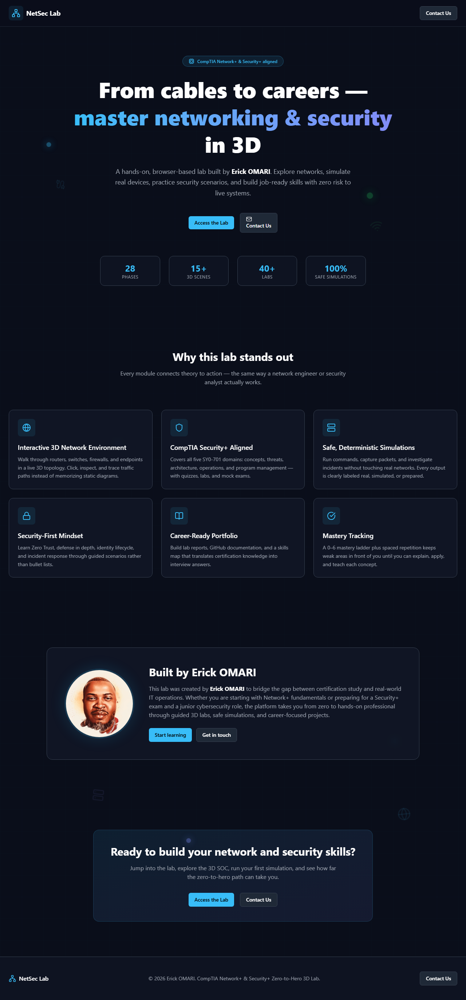

# CompTIA Security+ Zero-to-Hero — 3D Lab Platform

An interactive training platform that takes a learner from beginner to **CompTIA Security+ (SY0-701)** and **CompTIA Network+** exam-ready and junior SOC/IAM job-ready, using professional 3D environments and safe simulated labs.

> **Safety model:** every lab is a deterministic simulation backed by prepared artifacts. No real tool is executed, nothing touches a live system, and every output is labelled **real**, **simulated**, or **prepared**. No credentials, keys, tokens, or personal data appear anywhere in this repository.

## Landing page

A CompTIA Network+ / Security+ styled landing page introduces the lab, highlights the 3D network environment, and links directly into the app. It was created by **Erick OMARI**.



Open the landing page at `/landing` after starting the dev server.

## Status

**Phases 0–27 complete.** All roadmap phases are built and available in-app.

All six 3D scenes are verified rendering.

- [Phase 0 report](docs/PHASE-0-COMPLETION-REPORT.md) — Platform Foundation & Security Lab
- [Phase 1 report](docs/PHASE-1-COMPLETION-REPORT.md) — Computer, Network & Security Foundations
- [Phase 2 report](docs/PHASE-2-COMPLETION-REPORT.md) — Security Fundamentals
- [Phase 3 report](docs/PHASE-3-COMPLETION-REPORT.md) — Threats, Vulnerabilities & Attacks
- [Phase 4 report](docs/PHASE-4-COMPLETION-REPORT.md) — Security Architecture
- [Phase 5 report](docs/PHASE-5-COMPLETION-REPORT.md) — Identity & Access Management
- [Phase 6 report](docs/PHASE-6-COMPLETION-REPORT.md) — Cryptography & PKI
- [Phase 7 report](docs/PHASE-7-COMPLETION-REPORT.md) — Security Operations / SOC
- [Phase 8 report](docs/PHASE-8-COMPLETION-REPORT.md) — Windows Security
- [Phase 9 report](docs/PHASE-9-COMPLETION-REPORT.md) — Linux Security
- [Phase 10 report](docs/PHASE-10-COMPLETION-REPORT.md) — Vulnerability Management
- [Phase 11 report](docs/PHASE-11-COMPLETION-REPORT.md) — Network Security
- [Phase 12 report](docs/PHASE-12-COMPLETION-REPORT.md) — Incident Response

## Quick start

```bash
npm install --legacy-peer-deps
```

```bash
npm run dev
```

Then open http://localhost:5173.

`--legacy-peer-deps` is required because `typescript-eslint` declares a narrower TypeScript peer range than the ecosystem currently satisfies. See "Toolchain note" below.

## Commands

| Command                         | Description                          |
| ------------------------------- | ------------------------------------ |
| `npm run dev`                   | Start the dev server on port 5173    |
| `npm run build`                 | Typecheck, then build for production |
| `npm run preview`               | Preview the production build         |
| `npm test`                      | Run the full test suite              |
| `npm test -- tests/srs.test.ts` | Run a single test file               |
| `npm run lint`                  | Lint with ESLint                     |
| `npm run format`                | Format with Prettier                 |

## What is built

**Platform**

- **Dashboard** — course progress, mastery, weak areas, evidence count, spaced-repetition review queue
- **Roadmap** — 28 phases mapped to the five SY0-701 domains with their official weights
- **Quiz** — practice mode with instant explanations, and a timed mock-exam mode with per-domain breakdown and a readiness verdict
- **Progress & Mastery** — a 0–6 ladder with Leitner-interval spaced repetition
- **Notes** and an **Evidence Locker** — your artifacts, stored locally
- **GitHub Portfolio Generator** — turns a completed lab into a 7-file documented repository

**Phase 0 — Platform Foundation & Security Lab**

- **SOC Environment** — interactive 3D room with 9 inspectable devices, plus a 2D SVG fallback
- 1 lesson, 2 labs: entering the SOC, and first host triage

**Phase 1 — Computer, Network & Security Foundations**

- **Connection Path** — 3D visualisation of User → Endpoint → Network → Server → Security Controls, with a travelling packet and per-stage controls and detection opportunities
- 4 lessons, 6 labs: Windows and Linux endpoints, processes, network configuration, listening ports, and an end-to-end connection trace

**Phase 2 — Security Fundamentals**

- **Defence in Depth** — 3D concentric layers around one asset. Fail a layer and watch what still stands
- **Risk Scenario Workbench** — business scenarios where you place asset, threat, vulnerability, risk, control, and residual risk from one shared option pool
- 4 lessons, 3 labs: CIA and AAA, security principles, the language of risk, and the control taxonomy

**Phase 3 — Threats, Vulnerabilities & Attacks**

- **Attack Chain** — a simulated six-stage spear-phishing compromise in 3D. Break any one link and the chain stops
- 5 lessons, 5 labs: malware by behaviour, phishing analysis, password attacks, attack categories, and full chain reconstruction

**Phase 4 — Security Architecture**

- **Security Zones** — the enterprise architecture in 3D: Internet → DMZ → Core → Users / Servers / Management / Guest, with six inspectable boundaries
- 4 lessons, 4 labs: segmentation and zones, boundary controls, flow tracing, and an architecture review

**Phase 5 — Identity & Access Management** (major career component)

- **Identity Lifecycle** — the nine-stage joiner/mover/leaver ring in 3D, with each stage's controls and failure modes
- **IAM Troubleshooting** — three real identity failures, diagnosed in three parts: which stage failed, the root cause, the fix
- 6 lessons, 5 labs: AAA in practice, MFA and factor strength, SAML/OAuth/OIDC, LDAP and Kerberos, RBAC/ABAC/PAM, and the lifecycle
- 75 simulated commands across Windows, Linux, Nmap, and the platform, scoped per lab

> **Content safety.** Phase 3 teaches attacks for recognition and defence only. No malicious code, credential-handling logic, or attack tooling exists in this project — enforced by tests, not just by review.

## Architecture

Three layers, described in full in [`ARCHITECTURE.md`](ARCHITECTURE.md):

1. **Learning engine** — curriculum, progress, mastery, spaced repetition, quiz and exam grading (`src/lib`, `src/data`, `src/store`)
2. **3D engine** — React Three Fiber scenes with a 2D fallback (`src/scenes`)
3. **Simulation engine** — a deterministic lab runner over a closed command allowlist (`src/sim`)

## Stack

React 19 · TypeScript · Vite 8 · React Three Fiber + Three.js · Zustand · Tailwind CSS v4 · React Router 7 · Vitest + React Testing Library · ESLint + Prettier

### Toolchain note

TypeScript is pinned to **6.0.3**. TypeScript 7 (the native compiler rewrite) dropped the JS compiler API that `typescript-eslint` reads ASTs through, so linting is impossible against it today. Vite and Vitest never call `tsc`, so this affects only `npm run lint` and the typecheck step of `npm run build`. Revisit when `typescript-eslint` ships TS 7 support.

## Data and privacy

All learner state — progress, mastery, notes, evidence — lives in `localStorage` on your own machine. There is no backend, no account, and no telemetry.

## Authorised use

Everything in this platform is simulated. If you go on to practise these techniques with real tools, do so **only against systems you own or are explicitly authorised to test**, or against intentionally vulnerable lab environments built for the purpose.
